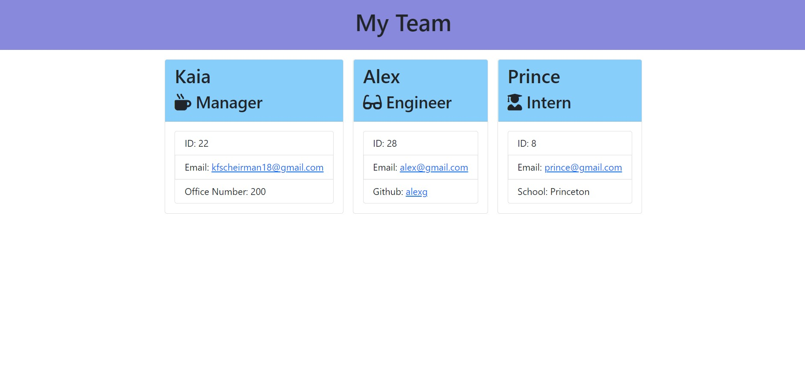

# Team Profile Generator
## Description
A Node.js application that takes user input and generates an HTML webpage for teams.  
Built With:
* Node.js
* Jest
* Inquirer
* HTML
* CSS 
* JavaScript

## Installation
1. Clone the repository onto your local machine using the `git clone` command.
2. Navigate into the root directory of the application.
3. Run `npm install` to install necessary packages and dependencies.
4. Enter the command `node index.js` to initiate the application. 
5. Answer all prompts.
* Your Team Profile HTML page will be located in the `dist/` folder.

## Tests
To run tests, enter the command `npm run test`.

## Demo
Link to video demonstration: [Team Profile Generator Walkthrough](https://drive.google.com/file/d/1rwax26PW6M_eHWs7PY8vENJtyYwSnjUu/view?usp=sharing)

## Mock Up 

